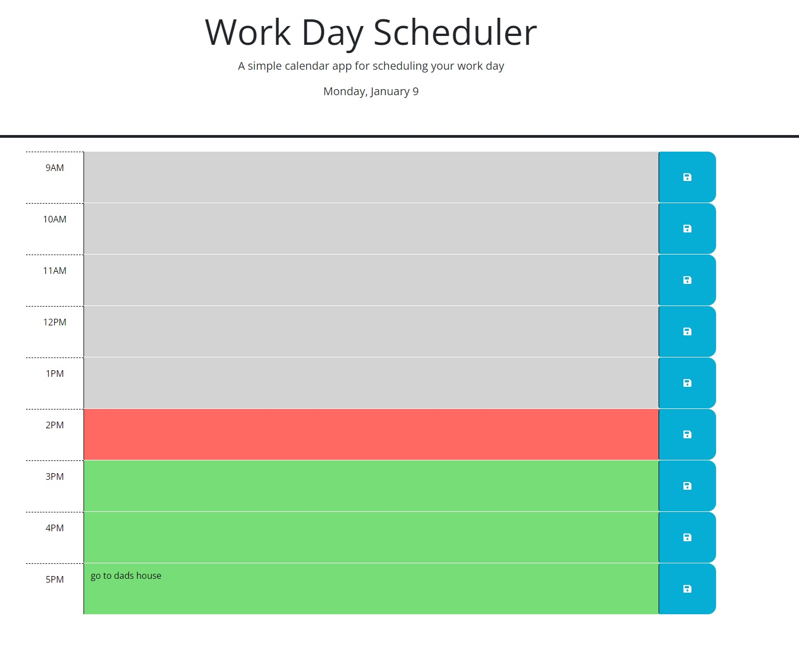
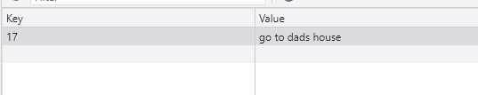

# Time-Planner-Challenge

## Description
This is a simple planner. This planner allows user to input what needs to be done in the specific time frame this will be saved in localstorage so when page refreshes the task will reload. Red background will indicate present, grey background means past and green means future.

In this challenge, we demonstrate our knowledge using jquery DOM and localstorage.

## Usage
The Use of this website is to give users a simple plan that keeps track of time.

## Features
Save button that saves userinput 
Working hour Rows that changes color depending what time it is.

